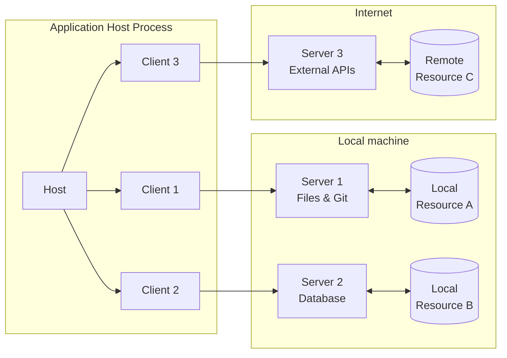
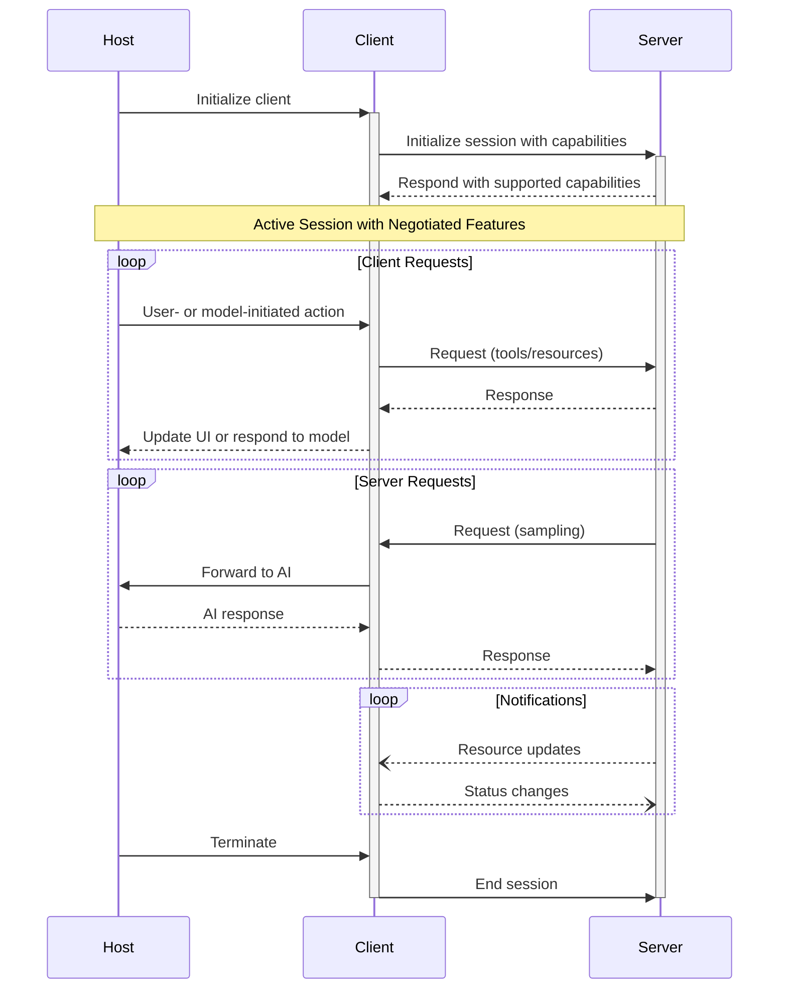
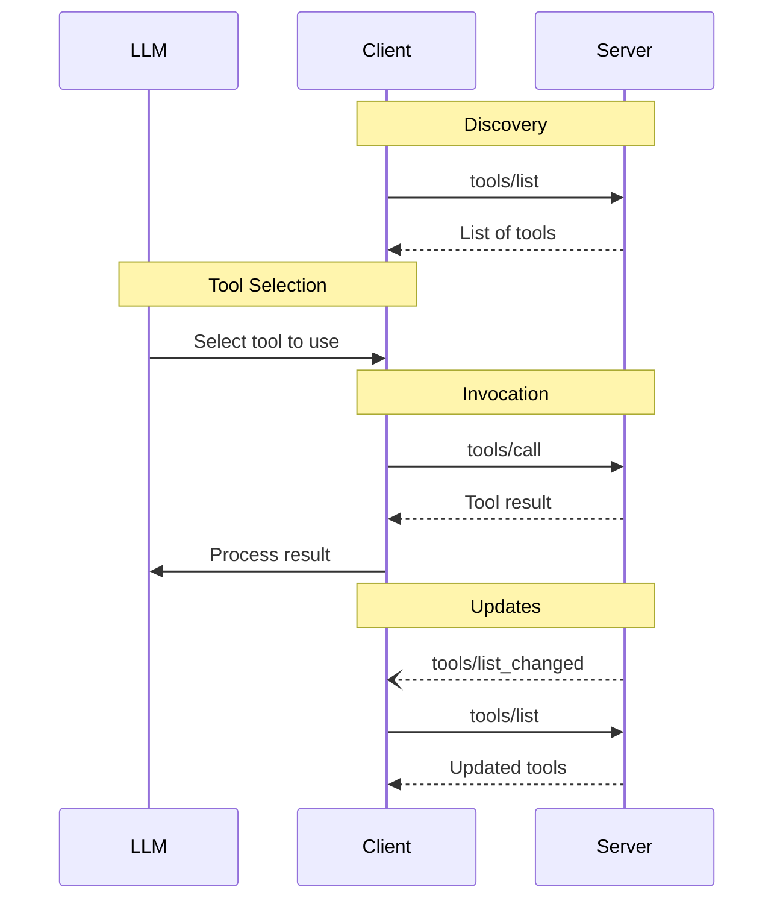
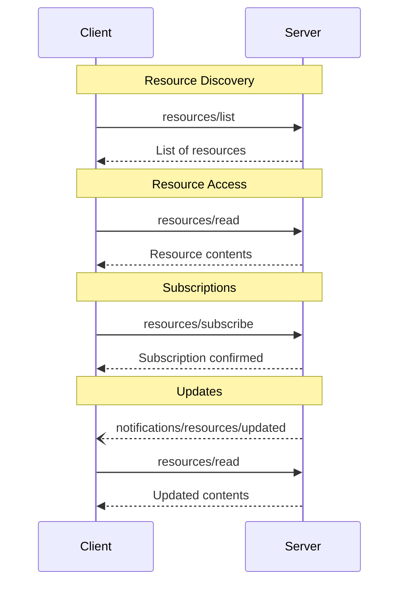
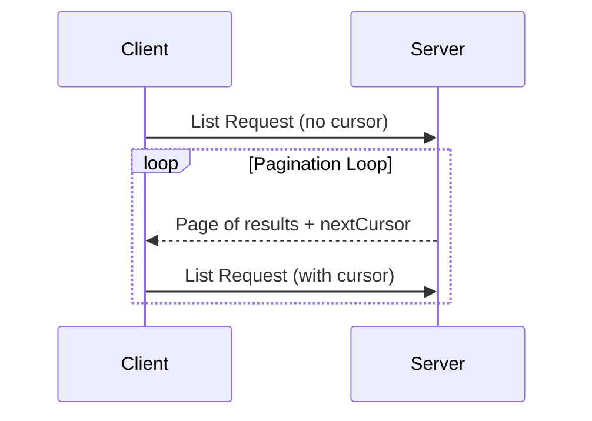

# MCP Package Docs Server - Go Rewrite Plan

## Objective

This document outlines the plan to rewrite the existing TypeScript-based MCP Package Docs server in Go. The primary objective is to improve efficiency and maintainability while retaining the core functionality of providing relevant package documentation (README summaries, usage examples, function/method signatures) for various programming languages (NPM, Go, Python, Rust, Swift) to AI agents. The rewrite will leverage the `mcp-go` library for the server framework. This rewrite aims for a **pure Go implementation**, omitting features that rely heavily on the Node.js ecosystem (like detailed `.d.ts` parsing and LSP).

## Scope

**In Scope:**

* Reimplementing the core MCP server logic in Go using `mcp-go`.
* Fetching package documentation from local installations and remote sources (registries, doc sites, code hosting).
* Parsing documentation, including filtering READMEs for relevant content (usage, API, examples) and stripping non-essential sections (contributors, license, etc.) using robust Markdown parsing (`yuin/goldmark`).
* Discovering and parsing additional documentation/examples from common repository locations (e.g., `docs/`, `examples/`) for NPM packages.
* Providing basic function/method signature extraction where feasible (potentially aided by Markdown AST analysis).
* Implementing fuzzy search capabilities.
* Supporting private NPM registries via `.npmrc` parsing.

**Out of Scope (Initial Rewrite):**

* Detailed NPM API information extracted via TypeScript AST analysis (`.d.ts` parsing).
* Language Server Protocol (LSP) features (hover, completion, diagnostics).

## Phased Implementation Plan

### Phase 1: Core Go Server using `mcp-go` (Pure Go - Optimised Flow)

**1. Project Setup & Server Foundation:**

* [x] Initialise Go module.
* [x] Add core dependencies (`mcp-go`, `goquery`, HTML-to-Markdown lib, `goldmark`, fuzzy search lib).
* [x] Set up basic MCP server structure using `server.NewMCPServer` (e.g., in `main.go` or `server/server.go`).
  * Use `server.NewMCPServer` with server name and version
  * Add server capabilities with `server.WithToolsCapabilities()`
  * For logging, use `server.WithLogging()` option or implement custom logging
* [x] Define core tool schemas (`search_package_docs`, `describe_*`, `get_npm_package_doc`) using `mcp.NewTool` with appropriate options:
  * Use `mcp.WithDescription()` for tool descriptions
  * Use `mcp.WithString()`, `mcp.WithNumber()`, etc. for parameters
  * Use `mcp.Required()` for required parameters
  * Use `mcp.Description()` for parameter descriptions
* [x] Implement basic stdio transport using `server.ServeStdio` (likely in `main.go`).
* [x] Implement logging to stderr using Go standard library (could be a separate `logger` package or integrated early).
* [x] Implement in-memory caching for tool results (could be part of the server struct or a `cache` package).

**2. Core Utilities Implementation:** (These might become separate utility files/packages)

* [x] Implement HTTP client logic using `net/http` (e.g., `utils/http_client.go`).
* [x] Implement command execution logic using `os/exec` (e.g., `utils/cmd_runner.go`).
* [x] Implement file system checks using `os` package (e.g., `utils/fs_utils.go`).
* [x] Implement `.npmrc` parsing logic in Go (e.g., `utils/npmrc_parser.go`).

**3. Parsing Logic Implementation:** (These might become separate `parsing` package/files)

* [x] Implement HTML processing (using `goquery` and HTML-to-Markdown lib).
* [x] Implement Markdown processing (using `yuin/goldmark` AST traversal for filtering and basic extraction).
* [x] Implement fuzzy search using a Go library (could be part of `parsing` or `utils`).

**4. Language-Specific Logic (NPM Focus):** (Likely a dedicated `npm` package/module)

* [x] **Enhanced NPM:** Implement logic to discover additional docs/examples (using core utilities).
* [x] **Enhanced NPM:** Implement logic to fetch and parse discovered Markdown docs and code examples (using parsing logic).

**5. Tool Handler Implementation & Wiring:** (Likely modifying the main server file and potentially adding handler files)

* [x] Implement handlers for `describe_go_package` (using core utilities).
* [x] Implement handlers for `describe_python_package` (using core utilities).
* [x] Implement handlers for `describe_rust_package` (using core utilities, HTML parsing).
* [x] Implement handlers for `describe_swift_package` (using core utilities).
* [x] Implement handlers for `describe_npm_package` (integrating core utilities, parsing, and enhanced NPM logic).
* [x] Implement handlers for `get_npm_package_doc` (integrating core utilities, parsing, and enhanced NPM logic).
* [x] Implement handlers for `search_package_docs` (integrating all fetching, parsing, search).
* [x] Register all handlers with the server using `server.AddTool(tool, handlerFunc)` where:
  * `tool` is the tool definition created with `mcp.NewTool`
  * `handlerFunc` is a function with signature `func(ctx context.Context, request mcp.CallToolRequest) (*mcp.CallToolResult, error)`
  * Handler functions should extract parameters from `request.Params.Arguments`
  * Return results using `mcp.NewToolResultText()` or custom `mcp.CallToolResult` structs

**6. Github Actions and Makefile Setup:**

- [x] Set up a basic `Makefile` for lint, build, test and version commands.
- [x] Ensure that the release process includes updating the version both in the tags (if on the main branch aka doing a release) and the version that is reported by the built application.

After completing a phase you should check off the completed items, if new work is discovered that must be completed in the next phase that's not already documented add it to the list and mark it as a new item. Then stop and wait for the user to review the work and plan.

## Progress Summary (10/04/2025)

### Completed Items
- [x] Initialised Go module
- [x] Added core dependencies:
  - `mcp-go` for the server framework
  - `goquery` for HTML parsing
  - `html-to-markdown` for converting HTML to Markdown
  - `goldmark` for Markdown processing
  - `fuzzysearch` for fuzzy search functionality
- [x] Set up basic MCP server structure using `server.NewMCPServer`
- [x] Defined core tool schemas for all required tools
- [x] Implemented basic stdio transport using `server.ServeStdio`
- [x] Implemented logging to stderr
- [x] Implemented in-memory caching for tool results
- [x] Implemented core utilities:
  - HTTP client logic (`utils/http_client.go`)
  - Command execution logic (`utils/cmd_runner.go`)
  - File system checks (`utils/fs_utils.go`)
  - `.npmrc` parsing logic (`utils/npmrc_parser.go`)
- [x] Implemented parsing logic:
  - HTML processing (`parsing/html_parser.go`)
  - Markdown processing (`parsing/markdown_parser.go`)
  - Fuzzy search functionality (`parsing/search.go`)
- [x] Implemented language-specific handlers:
  - NPM package handler (`handlers/npm_handler.go`)
  - Go package handler (`handlers/go_handler.go`)
  - Python package handler (`handlers/python_handler.go`)
  - Rust package handler (`handlers/rust_handler.go`)
  - Swift package handler (`handlers/swift_handler.go`)
- [x] Implemented search functionality for all supported languages
- [x] Fixed module path issues by updating the go.mod file to use the correct module path

### Progress Update (10/04/2025)

#### Recently Completed Items
- [x] Implemented unit tests for core utilities:
  - HTTP client tests (`utils/http_client_test.go`)
  - Command runner tests (`utils/cmd_runner_test.go`)
  - File system utilities tests (`utils/fs_utils_test.go`)
  - NPMRC parser tests (`utils/npmrc_parser_test.go`)
  - Search functionality tests (`parsing/search_test.go`)
- [x] Set up GitHub Actions workflow for CI/CD:
  - Created `.github/workflows/go-build.yml` for building and testing Go code
  - Configured workflow to run on changes to Go code, Makefile, or workflow file
  - Added steps for linting, building, testing, and generating coverage reports
  - Set up release artifact generation for multiple platforms

### Next Steps
1. Implement unit tests for the remaining components:
   - HTML parser tests
   - Markdown parser tests
   - Language-specific handler tests
2. Implement caching for documentation results to improve performance
3. Add more comprehensive error handling and logging
4. Improve documentation extraction and formatting for better readability
5. Consider adding support for additional package registries and sources
6. Add integration tests to verify end-to-end functionality

## IMPORTANT INFORMATION

The implementation MUST be MCP compliant, meaning when running in stdio mode it must don't output anything to stdout or stderr unless it's a valid MCP response, do not log to stderr or stdout as it will invalidate the MCP response.

### Additional Implementation Notes

1. **Server Context**: Use `server.ServerFromContext(ctx)` within handlers to access the server instance if needed (e.g., for sending notifications).

2. **Error Handling**: Return errors from handlers using standard Go errors or create custom error responses with `mcp.CallToolResult` with `isError: true`.

3. **Tool Result Types**:
   - Text results: `mcp.NewToolResultText("Your text here")`
   - Multiple content types: Create a `mcp.CallToolResult` with an array of different content types (text, images, etc.)
   - JSON results: Convert to string and use `mcp.NewToolResultText(jsonString)`

4. **Request Hooks**: Consider using `server.WithHooks()` for debugging during development, but ensure they don't output to stdout in production.

5. **Capabilities**: Only declare capabilities that are actually implemented. For the initial version, focus on tools capability only.

---

# MCP (Model Context Protocol) Documentation Follows

### Useful documentation:

mcp-go package usage examples
- https://raw.githubusercontent.com/mark3labs/mcp-go/refs/heads/main/README.md
- https://raw.githubusercontent.com/mark3labs/mcp-go/refs/heads/main/examples/everything/main.go
- https://raw.githubusercontent.com/mark3labs/mcp-go/refs/heads/main/examples/custom_context/main.go
- https://raw.githubusercontent.com/mark3labs/mcp-go/refs/heads/main/examples/filesystem_stdio_client/main.go

# Relevant MCP Documentation

<Info>**Protocol Revision**: 2025-03-26</Info>

Servers provide the fundamental building blocks for adding context to language models via
MCP. These primitives enable rich interactions between clients, servers, and language
models:

* **Prompts**: Pre-defined templates or instructions that guide language model
  interactions
* **Resources**: Structured data or content that provides additional context to the model
* **Tools**: Executable functions that allow models to perform actions or retrieve
  information

Each primitive can be summarized in the following control hierarchy:

| Primitive | Control                | Description                                        | Example                         |
| --------- | ---------------------- | -------------------------------------------------- | ------------------------------- |
| Prompts   | User-controlled        | Interactive templates invoked by user choice       | Slash commands, menu options    |
| Resources | Application-controlled | Contextual data attached and managed by the client | File contents, git history      |
| Tools     | Model-controlled       | Functions exposed to the LLM to take actions       | API POST requests, file writing |

### MCP specification

# Specification

[Model Context Protocol](https://modelcontextprotocol.io) (MCP) is an open protocol that
enables seamless integration between LLM applications and external data sources and
tools. Whether you're building an AI-powered IDE, enhancing a chat interface, or creating
custom AI workflows, MCP provides a standardized way to connect LLMs with the context
they need.

This specification defines the authoritative protocol requirements, based on the
TypeScript schema in
[schema.ts](https://github.com/modelcontextprotocol/specification/blob/main/schema/2025-03-26/schema.ts).

For implementation guides and examples, visit
[modelcontextprotocol.io](https://modelcontextprotocol.io).

## Overview

MCP provides a standardized way for applications to:

* Share contextual information with language models
* Expose tools and capabilities to AI systems
* Build composable integrations and workflows

The protocol uses [JSON-RPC](https://www.jsonrpc.org/) 2.0 messages to establish
communication between:

* **Hosts**: LLM applications that initiate connections
* **Clients**: Connectors within the host application
* **Servers**: Services that provide context and capabilities

MCP takes some inspiration from the
[Language Server Protocol](https://microsoft.github.io/language-server-protocol/), which
standardizes how to add support for programming languages across a whole ecosystem of
development tools. In a similar way, MCP standardizes how to integrate additional context
and tools into the ecosystem of AI applications.

## Key Details

### Base Protocol

* [JSON-RPC](https://www.jsonrpc.org/) message format
* Stateful connections
* Server and client capability negotiation

### Features

Servers offer any of the following features to clients:

* **Resources**: Context and data, for the user or the AI model to use
* **Prompts**: Templated messages and workflows for users
* **Tools**: Functions for the AI model to execute


# Architecture

The Model Context Protocol (MCP) follows a client-host-server architecture where each
host can run multiple client instances. This architecture enables users to integrate AI
capabilities across applications while maintaining clear security boundaries and
isolating concerns. Built on JSON-RPC, MCP provides a stateful session protocol focused
on context exchange and sampling coordination between clients and servers.

## Core Components



### Host

The host process acts as the container and coordinator:

* Creates and manages multiple client instances
* Controls client connection permissions and lifecycle
* Enforces security policies and consent requirements
* Handles user authorization decisions
* Coordinates AI/LLM integration and sampling
* Manages context aggregation across clients

### Clients

Each client is created by the host and maintains an isolated server connection:

* Establishes one stateful session per server
* Handles protocol negotiation and capability exchange
* Routes protocol messages bidirectionally
* Manages subscriptions and notifications
* Maintains security boundaries between servers

A host application creates and manages multiple clients, with each client having a 1:1
relationship with a particular server.

### Servers

Servers provide specialized context and capabilities:

* Expose resources, tools and prompts via MCP primitives
* Operate independently with focused responsibilities
* Request sampling through client interfaces
* Must respect security constraints
* Can be local processes or remote services

## Design Principles

MCP is built on several key design principles that inform its architecture and
implementation:

1. **Servers should be extremely easy to build**

   * Host applications handle complex orchestration responsibilities
   * Servers focus on specific, well-defined capabilities
   * Simple interfaces minimize implementation overhead
   * Clear separation enables maintainable code

2. **Servers should be highly composable**

   * Each server provides focused functionality in isolation
   * Multiple servers can be combined seamlessly
   * Shared protocol enables interoperability
   * Modular design supports extensibility

3. **Servers should not be able to read the whole conversation, nor "see into" other
   servers**

   * Servers receive only necessary contextual information
   * Full conversation history stays with the host
   * Each server connection maintains isolation
   * Cross-server interactions are controlled by the host
   * Host process enforces security boundaries

4. **Features can be added to servers and clients progressively**
   * Core protocol provides minimal required functionality
   * Additional capabilities can be negotiated as needed
   * Servers and clients evolve independently
   * Protocol designed for future extensibility
   * Backwards compatibility is maintained

## Capability Negotiation

The Model Context Protocol uses a capability-based negotiation system where clients and
servers explicitly declare their supported features during initialization. Capabilities
determine which protocol features and primitives are available during a session.

* Servers declare capabilities like resource subscriptions, tool support, and prompt
  templates
* Clients declare capabilities like sampling support and notification handling
* Both parties must respect declared capabilities throughout the session
* Additional capabilities can be negotiated through extensions to the protocol



Each capability unlocks specific protocol features for use during the session. For
example:

* Implemented [server features](/specification/2025-03-26/server) must be advertised in the
  server's capabilities
* Emitting resource subscription notifications requires the server to declare
  subscription support
* Tool invocation requires the server to declare tool capabilities
* [Sampling](/specification/2025-03-26/client) requires the client to declare support in its
  capabilities

This capability negotiation ensures clients and servers have a clear understanding of
supported functionality while maintaining protocol extensibility.


# Tools

<Info>**Protocol Revision**: 2025-03-26</Info>

The Model Context Protocol (MCP) allows servers to expose tools that can be invoked by
language models. Tools enable models to interact with external systems, such as querying
databases, calling APIs, or performing computations. Each tool is uniquely identified by
a name and includes metadata describing its schema.

## User Interaction Model

Tools in MCP are designed to be **model-controlled**, meaning that the language model can
discover and invoke tools automatically based on its contextual understanding and the
user's prompts.

However, implementations are free to expose tools through any interface pattern that
suits their needs—the protocol itself does not mandate any specific user
interaction model.

<Warning>
  For trust & safety and security, there **SHOULD** always
  be a human in the loop with the ability to deny tool invocations.

  Applications **SHOULD**:

  * Provide UI that makes clear which tools are being exposed to the AI model
  * Insert clear visual indicators when tools are invoked
  * Present confirmation prompts to the user for operations, to ensure a human is in the
    loop
</Warning>

## Capabilities

Servers that support tools **MUST** declare the `tools` capability:

```json
{
  "capabilities": {
    "tools": {
      "listChanged": true
    }
  }
}
```

`listChanged` indicates whether the server will emit notifications when the list of
available tools changes.

## Protocol Messages

### Listing Tools

To discover available tools, clients send a `tools/list` request. This operation supports
[pagination](/specification/2025-03-26/server/utilities/pagination).

**Request:**

```json
{
  "jsonrpc": "2.0",
  "id": 1,
  "method": "tools/list",
  "params": {
    "cursor": "optional-cursor-value"
  }
}
```

**Response:**

```json
{
  "jsonrpc": "2.0",
  "id": 1,
  "result": {
    "tools": [
      {
        "name": "get_weather",
        "description": "Get current weather information for a location",
        "inputSchema": {
          "type": "object",
          "properties": {
            "location": {
              "type": "string",
              "description": "City name or zip code"
            }
          },
          "required": ["location"]
        }
      }
    ],
    "nextCursor": "next-page-cursor"
  }
}
```

### Calling Tools

To invoke a tool, clients send a `tools/call` request:

**Request:**

```json
{
  "jsonrpc": "2.0",
  "id": 2,
  "method": "tools/call",
  "params": {
    "name": "get_weather",
    "arguments": {
      "location": "New York"
    }
  }
}
```

**Response:**

```json
{
  "jsonrpc": "2.0",
  "id": 2,
  "result": {
    "content": [
      {
        "type": "text",
        "text": "Current weather in New York:\nTemperature: 72°F\nConditions: Partly cloudy"
      }
    ],
    "isError": false
  }
}
```

### List Changed Notification

When the list of available tools changes, servers that declared the `listChanged`
capability **SHOULD** send a notification:

```json
{
  "jsonrpc": "2.0",
  "method": "notifications/tools/list_changed"
}
```

## Message Flow



## Data Types

### Tool

A tool definition includes:

* `name`: Unique identifier for the tool
* `description`: Human-readable description of functionality
* `inputSchema`: JSON Schema defining expected parameters
* `annotations`: optional properties describing tool behavior

<Warning>For trust & safety and security, clients **MUST** consider
tool annotations to be untrusted unless they come from trusted servers.</Warning>

### Tool Result

Tool results can contain multiple content items of different types:

#### Text Content

```json
{
  "type": "text",
  "text": "Tool result text"
}
```

#### Image Content

```json
{
  "type": "image",
  "data": "base64-encoded-data",
  "mimeType": "image/png"
}
```

#### Audio Content

```json
{
  "type": "audio",
  "data": "base64-encoded-audio-data",
  "mimeType": "audio/wav"
}
```

#### Embedded Resources

[Resources](/specification/2025-03-26/server/resources) **MAY** be embedded, to provide additional context
or data, behind a URI that can be subscribed to or fetched again by the client later:

```json
{
  "type": "resource",
  "resource": {
    "uri": "resource://example",
    "mimeType": "text/plain",
    "text": "Resource content"
  }
}
```

## Error Handling

Tools use two error reporting mechanisms:

1. **Protocol Errors**: Standard JSON-RPC errors for issues like:

   * Unknown tools
   * Invalid arguments
   * Server errors

2. **Tool Execution Errors**: Reported in tool results with `isError: true`:
   * API failures
   * Invalid input data
   * Business logic errors

Example protocol error:

```json
{
  "jsonrpc": "2.0",
  "id": 3,
  "error": {
    "code": -32602,
    "message": "Unknown tool: invalid_tool_name"
  }
}
```

Example tool execution error:

```json
{
  "jsonrpc": "2.0",
  "id": 4,
  "result": {
    "content": [
      {
        "type": "text",
        "text": "Failed to fetch weather data: API rate limit exceeded"
      }
    ],
    "isError": true
  }
}
```

## Security Considerations

1. Servers **MUST**:

   * Validate all tool inputs
   * Implement proper access controls
   * Rate limit tool invocations
   * Sanitize tool outputs

# Resources

<Info>**Protocol Revision**: 2025-03-26</Info>

The Model Context Protocol (MCP) provides a standardized way for servers to expose
resources to clients. Resources allow servers to share data that provides context to
language models, such as files, database schemas, or application-specific information.
Each resource is uniquely identified by a
[URI](https://datatracker.ietf.org/doc/html/rfc3986).

## User Interaction Model

Resources in MCP are designed to be **application-driven**, with host applications
determining how to incorporate context based on their needs.

For example, applications could:

* Expose resources through UI elements for explicit selection, in a tree or list view
* Allow the user to search through and filter available resources
* Implement automatic context inclusion, based on heuristics or the AI model's selection


However, implementations are free to expose resources through any interface pattern that
suits their needs—the protocol itself does not mandate any specific user
interaction model.

## Capabilities

Servers that support resources **MUST** declare the `resources` capability:

```json
{
  "capabilities": {
    "resources": {
      "subscribe": true,
      "listChanged": true
    }
  }
}
```

The capability supports two optional features:

* `subscribe`: whether the client can subscribe to be notified of changes to individual
  resources.
* `listChanged`: whether the server will emit notifications when the list of available
  resources changes.

Both `subscribe` and `listChanged` are optional—servers can support neither,
either, or both:

```json
{
  "capabilities": {
    "resources": {} // Neither feature supported
  }
}
```

```json
{
  "capabilities": {
    "resources": {
      "subscribe": true // Only subscriptions supported
    }
  }
}
```

```json
{
  "capabilities": {
    "resources": {
      "listChanged": true // Only list change notifications supported
    }
  }
}
```

## Protocol Messages

### Listing Resources

To discover available resources, clients send a `resources/list` request. This operation
supports [pagination](/specification/2025-03-26/server/utilities/pagination).

**Request:**

```json
{
  "jsonrpc": "2.0",
  "id": 1,
  "method": "resources/list",
  "params": {
    "cursor": "optional-cursor-value"
  }
}
```

**Response:**

```json
{
  "jsonrpc": "2.0",
  "id": 1,
  "result": {
    "resources": [
      {
        "uri": "file:///project/src/main.rs",
        "name": "main.rs",
        "description": "Primary application entry point",
        "mimeType": "text/x-rust"
      }
    ],
    "nextCursor": "next-page-cursor"
  }
}
```

### Reading Resources

To retrieve resource contents, clients send a `resources/read` request:

**Request:**

```json
{
  "jsonrpc": "2.0",
  "id": 2,
  "method": "resources/read",
  "params": {
    "uri": "file:///project/src/main.rs"
  }
}
```

**Response:**

```json
{
  "jsonrpc": "2.0",
  "id": 2,
  "result": {
    "contents": [
      {
        "uri": "file:///project/src/main.rs",
        "mimeType": "text/x-rust",
        "text": "fn main() {\n    println!(\"Hello world!\");\n}"
      }
    ]
  }
}
```

### Resource Templates

Resource templates allow servers to expose parameterized resources using
[URI templates](https://datatracker.ietf.org/doc/html/rfc6570). Arguments may be
auto-completed through [the completion API](/specification/2025-03-26/server/utilities/completion).

**Request:**

```json
{
  "jsonrpc": "2.0",
  "id": 3,
  "method": "resources/templates/list"
}
```

**Response:**

```json
{
  "jsonrpc": "2.0",
  "id": 3,
  "result": {
    "resourceTemplates": [
      {
        "uriTemplate": "file:///{path}",
        "name": "Project Files",
        "description": "Access files in the project directory",
        "mimeType": "application/octet-stream"
      }
    ]
  }
}
```

### List Changed Notification

When the list of available resources changes, servers that declared the `listChanged`
capability **SHOULD** send a notification:

```json
{
  "jsonrpc": "2.0",
  "method": "notifications/resources/list_changed"
}
```

### Subscriptions

The protocol supports optional subscriptions to resource changes. Clients can subscribe
to specific resources and receive notifications when they change:

**Subscribe Request:**

```json
{
  "jsonrpc": "2.0",
  "id": 4,
  "method": "resources/subscribe",
  "params": {
    "uri": "file:///project/src/main.rs"
  }
}
```

**Update Notification:**

```json
{
  "jsonrpc": "2.0",
  "method": "notifications/resources/updated",
  "params": {
    "uri": "file:///project/src/main.rs"
  }
}
```

## Message Flow



## Data Types

### Resource

A resource definition includes:

* `uri`: Unique identifier for the resource
* `name`: Human-readable name
* `description`: Optional description
* `mimeType`: Optional MIME type
* `size`: Optional size in bytes

### Resource Contents

Resources can contain either text or binary data:

#### Text Content

```json
{
  "uri": "file:///example.txt",
  "mimeType": "text/plain",
  "text": "Resource content"
}
```

#### Binary Content

```json
{
  "uri": "file:///example.png",
  "mimeType": "image/png",
  "blob": "base64-encoded-data"
}
```

## Common URI Schemes

The protocol defines several standard URI schemes. This list not
exhaustive—implementations are always free to use additional, custom URI schemes.

### https\://

Used to represent a resource available on the web.

Servers **SHOULD** use this scheme only when the client is able to fetch and load the
resource directly from the web on its own—that is, it doesn’t need to read the resource
via the MCP server.

For other use cases, servers **SHOULD** prefer to use another URI scheme, or define a
custom one, even if the server will itself be downloading resource contents over the
internet.

### file://

Used to identify resources that behave like a filesystem. However, the resources do not
need to map to an actual physical filesystem.

MCP servers **MAY** identify file:// resources with an
[XDG MIME type](https://specifications.freedesktop.org/shared-mime-info-spec/0.14/ar01s02.html#id-1.3.14),
like `inode/directory`, to represent non-regular files (such as directories) that don’t
otherwise have a standard MIME type.

### git://

Git version control integration.

## Error Handling

Servers **SHOULD** return standard JSON-RPC errors for common failure cases:

* Resource not found: `-32002`
* Internal errors: `-32603`

Example error:

```json
{
  "jsonrpc": "2.0",
  "id": 5,
  "error": {
    "code": -32002,
    "message": "Resource not found",
    "data": {
      "uri": "file:///nonexistent.txt"
    }
  }
}
```

## Security Considerations

1. Servers **MUST** validate all resource URIs
2. Access controls **SHOULD** be implemented for sensitive resources
3. Binary data **MUST** be properly encoded
4. Resource permissions **SHOULD** be checked before operations

# Pagination

<Info>**Protocol Revision**: 2025-03-26</Info>

The Model Context Protocol (MCP) supports paginating list operations that may return
large result sets. Pagination allows servers to yield results in smaller chunks rather
than all at once.

Pagination is especially important when connecting to external services over the
internet, but also useful for local integrations to avoid performance issues with large
data sets.

## Pagination Model

Pagination in MCP uses an opaque cursor-based approach, instead of numbered pages.

* The **cursor** is an opaque string token, representing a position in the result set
* **Page size** is determined by the server, and clients **MUST NOT** assume a fixed page
  size

## Response Format

Pagination starts when the server sends a **response** that includes:

* The current page of results
* An optional `nextCursor` field if more results exist

```json
{
  "jsonrpc": "2.0",
  "id": "123",
  "result": {
    "resources": [...],
    "nextCursor": "eyJwYWdlIjogM30="
  }
}
```

## Request Format

After receiving a cursor, the client can *continue* paginating by issuing a request
including that cursor:

```json
{
  "jsonrpc": "2.0",
  "method": "resources/list",
  "params": {
    "cursor": "eyJwYWdlIjogMn0="
  }
}
```

## Pagination Flow



## Operations Supporting Pagination

The following MCP operations support pagination:

* `resources/list` - List available resources
* `resources/templates/list` - List resource templates
* `prompts/list` - List available prompts
* `tools/list` - List available tools

## Implementation Guidelines

1. Servers **SHOULD**:

   * Provide stable cursors
   * Handle invalid cursors gracefully

2. Clients **SHOULD**:

   * Treat a missing `nextCursor` as the end of results
   * Support both paginated and non-paginated flows

3. Clients **MUST** treat cursors as opaque tokens:
   * Don't make assumptions about cursor format
   * Don't attempt to parse or modify cursors
   * Don't persist cursors across sessions

## Error Handling

Invalid cursors **SHOULD** result in an error with code -32602 (Invalid params).


END OF MCP DOCUMENTATION

---
